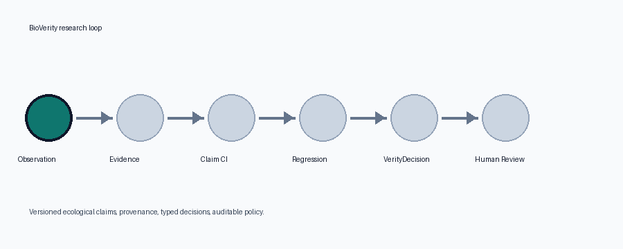

# BioVerity

**BioVerity** is an open research platform for continuously testing ecological knowledge against changing observational and scientific evidence. It represents ecological hypotheses as versioned machine-testable claims, detects ecological regressions, and uses a calibrated decision layer to determine when to monitor, investigate, escalate, or collect additional evidence.



The animation follows the synthetic demo fixture. Regenerate it with `pip install -e ".[media]"` and `python scripts/render_repo_gif.py`.

## MVP Focus

BioVerity starts with one constrained research loop:

1. Normalize ecological observations with provenance.
2. Convert accepted observations into structured evidence.
3. Attach evidence to versioned ecological claims.
4. Re-evaluate claims deterministically through Claim CI.
5. Route regressions through VerityDecision and auditable policy.
6. Preserve human review for consequential scientific action.

The initial demo case study uses spotted lanternfly interactions in the U.S. Mid-Atlantic as open, reproducible fixture data.

## Repository Layout

```text
backend/bioverity/  FastAPI app, schemas, decision and policy logic
specs/              JSON Schemas for BioVerity Spec records
datasets/fixtures/  Open demo observations, evidence, claims, policies
docs/               Architecture, thesis, evaluation, ADRs, backlog
frontend/           Presentable MVP screen specification and shell
tests/              Unit and contract tests
scripts/            Demo and validation helpers
assets/             Repository media, including the project GIF
```

## Local Setup

```bash
python -m venv .venv
source .venv/bin/activate
pip install -e ".[dev]"
pytest
uvicorn bioverity.api.main:app --reload --app-dir backend
```

The API will be available at `http://127.0.0.1:8000`.

## Docker

```bash
docker compose up
```

This starts PostgreSQL with PostGIS enabled and the BioVerity API.

## Demo

Run the deterministic end-to-end loop:

```bash
python scripts/seed_demo.py
```

Expected path:

```text
supported claim
→ new evidence snapshot
→ drifting claim
→ structured investigation
→ next-best-evidence decision
→ policy requires researcher review
```

## Open Source

BioVerity is released under the MIT License. Demo data in `datasets/fixtures/` is synthetic/open fixture content for reproducible development and should be replaced or expanded with properly licensed source data for research claims.
